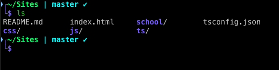

# Zsh-Theme : Arity
A simple Zsh shell theme.
Arity is a theme designed for readability and to give an overview _at a glance_.

## Features
Arity displays 
* The path in green 
* Git status in cyan, seperated by a pipe. Automatically appears and disappears
	* Contains branch name, and whether you have untracked changes
* As __2__ lines
	* Typing in the next line lets you use the whole console's width for command.
	* Gives a whole line for you path. Feel free to be 10 folder deep.
	* Both lines are smoothly connected with ASCII art
